# BrickHub

Webapplikation zur Verwaltung, Inventarisierung und Einlagerung von Klemmbausteinsets. Entwickelt für den Einsatz auf einem Unraid-Server via Docker.


---

## Worum geht es?

Es geht rund um das Thema **Klemmbausteine** und dessen Inventarisierung. Wer viele Sets sammelt, kennt das Problem: Welche Sets habe ich? Wo liegen die eingelagerten Sets? Welche Kiste enthält welche Sets? Aus wie viele Tüten und Platten besteht das Set?

**BrickHub** löst genau dieses Problem. Es ist eine selbst gehostete Inventar-Webanwendung, mit der du:

- alle deine Sets mit Bildern, Teilezahl, Status und Kategorien erfasst
- Kisten und Lagerorte verwaltest und Sets diesen zuordnest
- automatisch beschriftete PDF-Einlagerungsschilder für einzelne Tüten und Platten generierst
- Frontcover- und Backcover-Fotos hochlädst, perspektivkorrigierst und freistellt
- ein vollständiges Backup deines Inventars erstellen und wiederherstellen kannst
- Sets optional mit OneDrive-Ordnern (z.B. für Bauanleitungen) verknüpfst

---

## Hinweise & Haftungsausschluss

> **Privatprojekt – bitte vor der Nutzung lesen.**

- **Privatprojekt**: BrickHub ist ein Hobbyprojekt, das für den persönlichen Eigenbedarf entwickelt wurde. Es wird ohne Garantie auf Vollständigkeit, Korrektheit, Stabilität oder Sicherheit bereitgestellt.
- **Nur für den privaten Heimnetz-Einsatz**: Die Anwendung ist **nicht** für den Betrieb im öffentlichen Internet gedacht und ausgelegt. Es fehlen dafür notwendige Härtungen (z.B. Rate-Limiting für alle Endpunkte, professionelles Monitoring, regelmäßige Sicherheitsaudits). Betreibe BrickHub ausschließlich in deinem lokalen Heimnetz oder hinter einem gesicherten privaten VPN.
- **Keine Haftung**: Der Entwickler übernimmt keinerlei Haftung für Datenverlust, Sicherheitsvorfälle oder sonstige Schäden, die durch die Nutzung dieser Software entstehen. Die Verwendung erfolgt auf eigene Gefahr.
- **Issues willkommen, aber ohne Garantie**: Bugreports und Featurewünsche können gerne als Issue eingereicht werden. Da es sich um ein Privatprojekt handelt, gibt es jedoch keine Garantie auf Umsetzung – neue Funktionen werden nur eingebaut, wenn sie zur eigenen Nutzung und Vorstellung des Projekts passen.
- **KI-generierter Code**: Der Großteil des Codes wurde mit Hilfe von [Claude Code](https://claude.ai/code) (Anthropic) erstellt.

---

## Screenshots

### Login
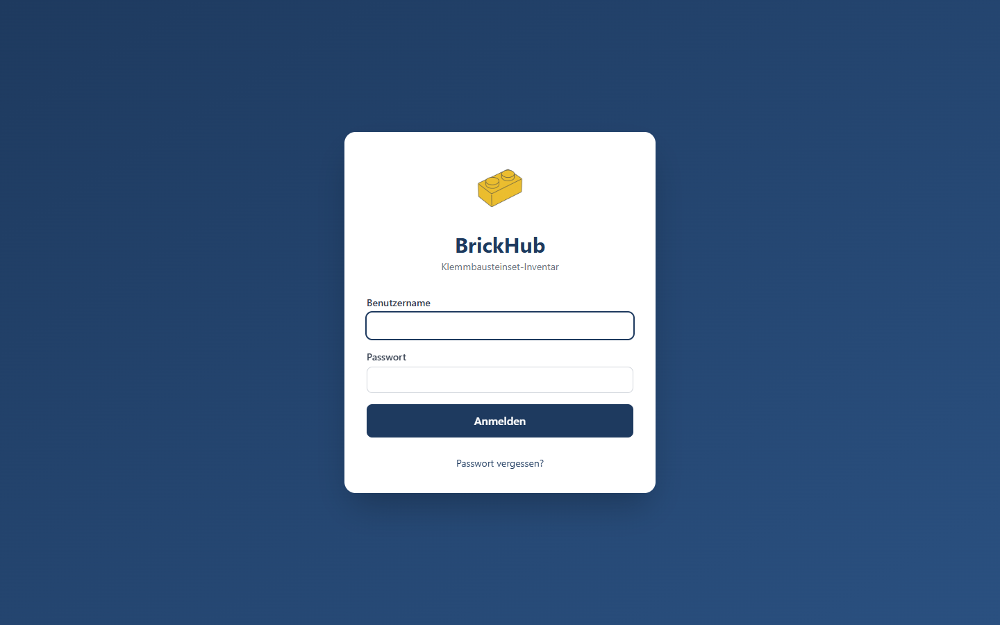

### Set-Übersicht mit Summary-Dashboard und Statistik-Icons
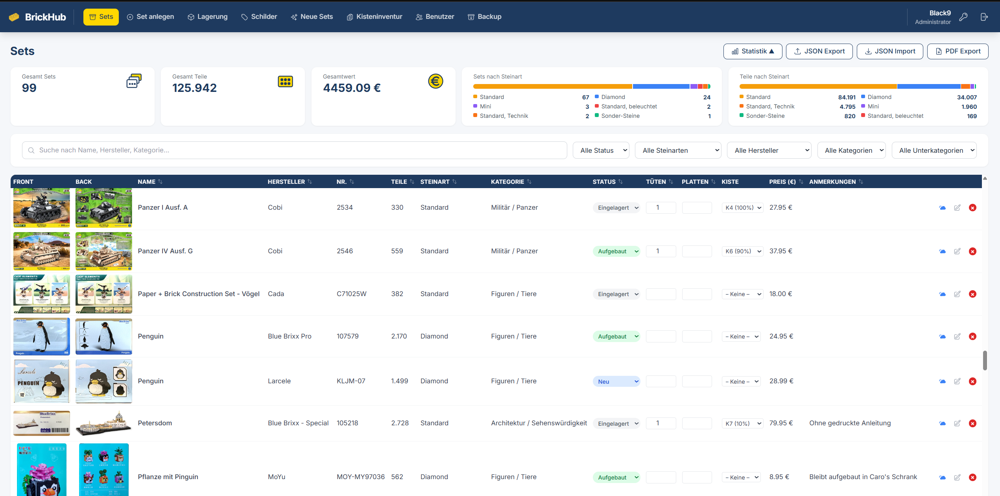

### PDF-Setliste exportieren
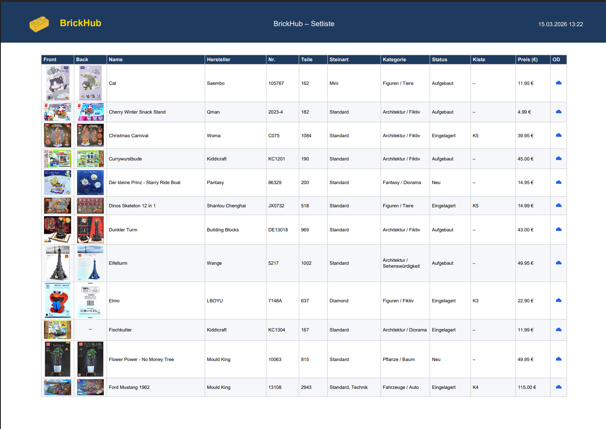

### Backup exportieren / importieren mit Fortschrittsanzeige
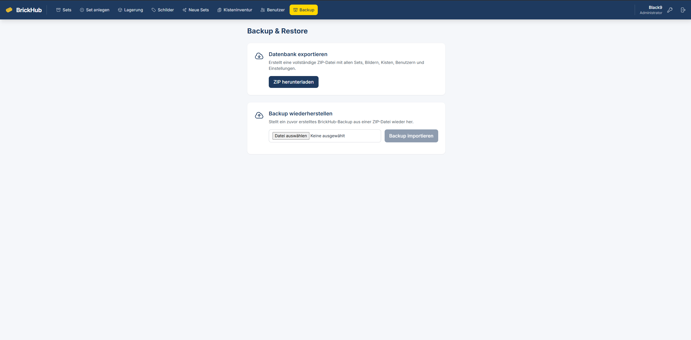

### Set bearbeiten – Grunddaten & OneDrive
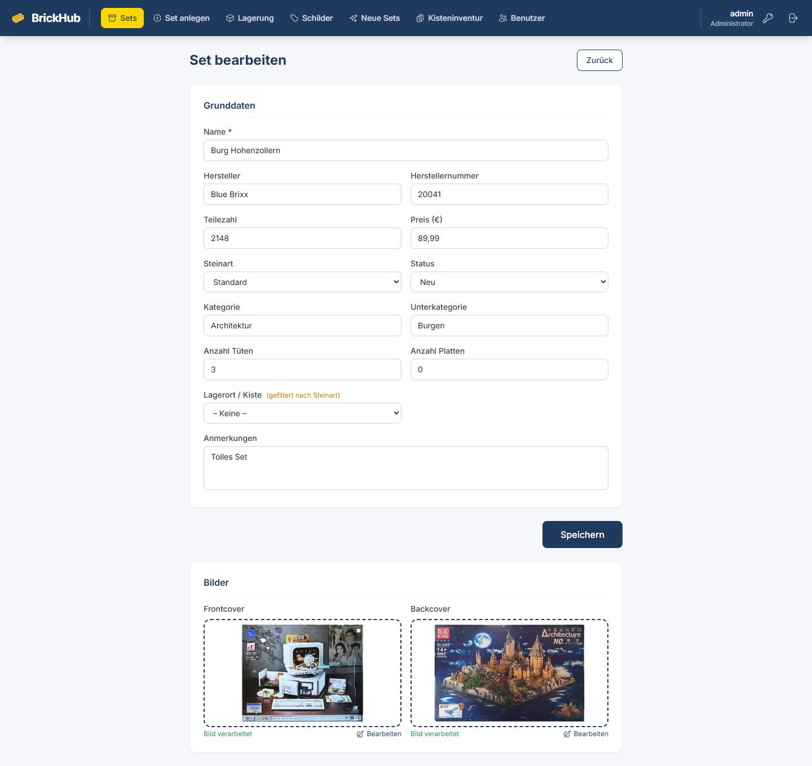

### Set bearbeiten – Bilder-Upload & Verarbeitung
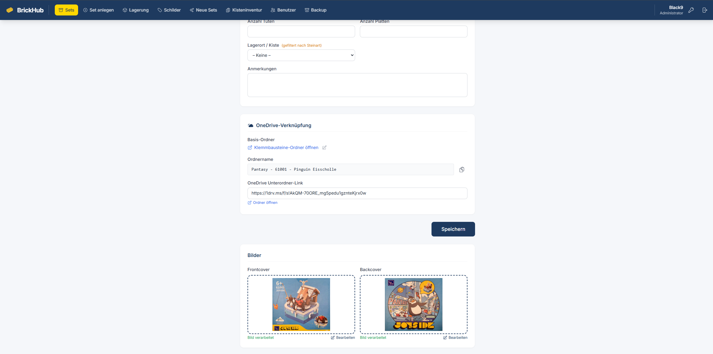

### Bildverarbeitung – Bild hochladen oder vorhandenes bearbeiten
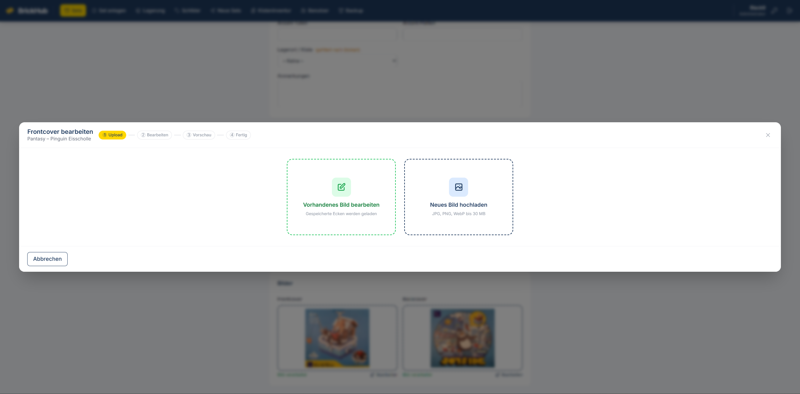

### ImageEditor – Eckpunkte setzen & Perspektivkorrektur
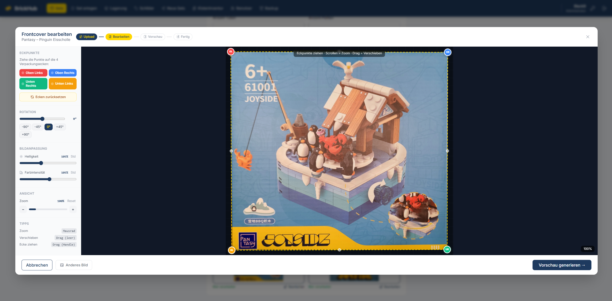

### Lagerverwaltung – Kisten
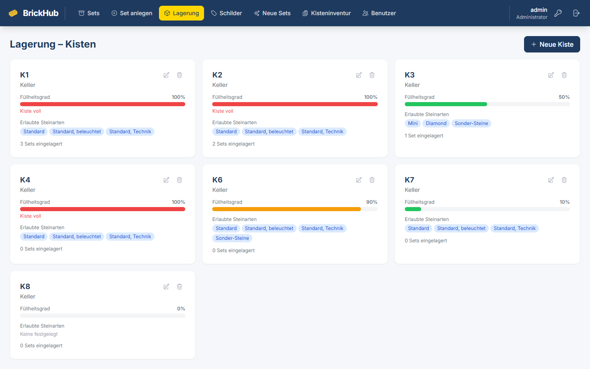

### Kisteninventur – Welches Set liegt wo?
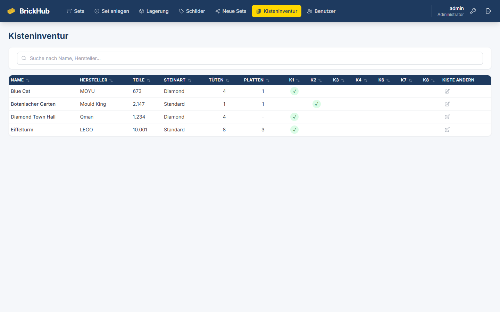

### Einlagerungsschilder generieren
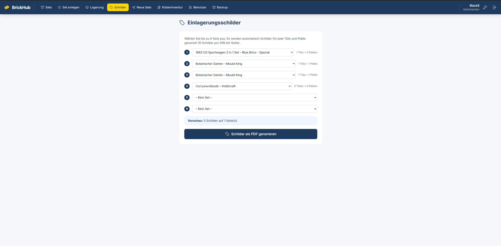

### Beispiel: Generiertes Schilder-PDF
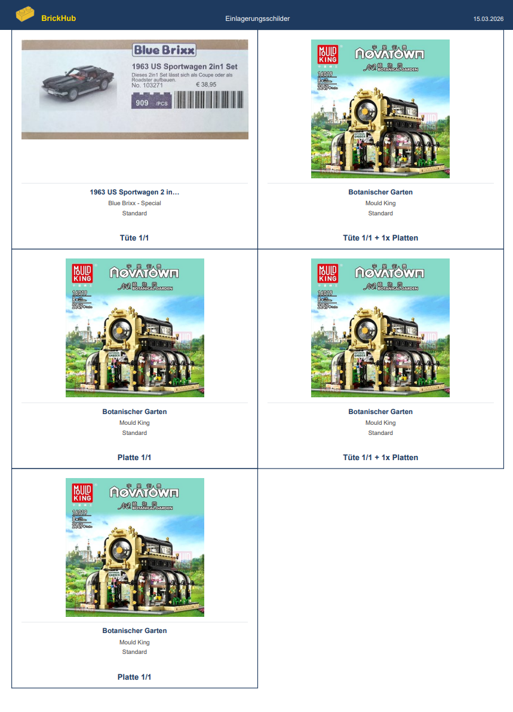

### Benutzerverwaltung
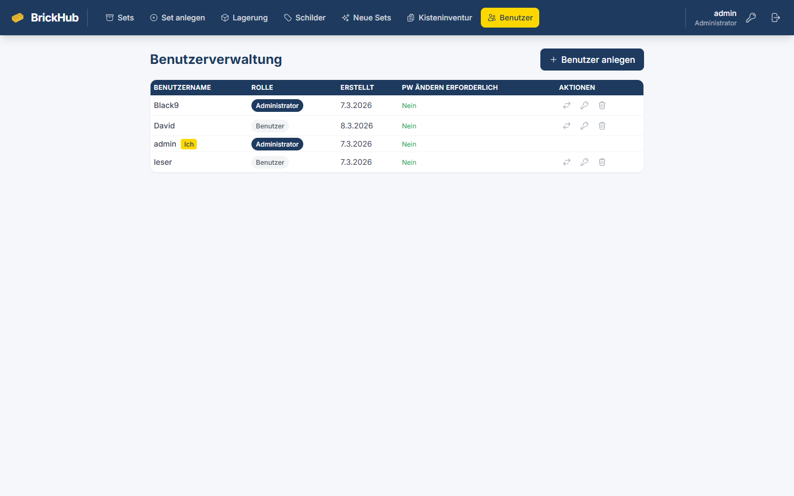

---

## Funktionsumfang

### Set-Verwaltung

Die Hauptansicht zeigt alle Klemmbausteinsets in einer sortierbaren Tabelle mit Front- und Backcover-Thumbnails. Über der Tabelle bieten fünf Summary-Karten mit Icons einen schnellen Überblick: Anzahl Sets, Gesamtteile, Gesamtwert sowie zwei Steinart-Statistiken mit farbigem gestapeltem Balken und 2-spaltiger Legende (Sets nach Steinart / Teile nach Steinart). Gleiche Steinarten haben in beiden Karten immer dieselbe Farbe. Die Statistikansicht lässt sich per Klick ein- und ausblenden.

- **CRUD-Operationen**: Sets anlegen, bearbeiten, löschen mit allen relevanten Daten (Name, Hersteller, Artikelnummer, Teilezahl, Steingröße, Kategorie, Unterkategorie, Preis, Status, Anmerkungen)
- **Inline-Bearbeitung**: Status, Tütenanzahl, Plattenanzahl, Kistenzuordnung und Anmerkungen lassen sich direkt in der Tabellenansicht ändern – ohne die Bearbeitungsseite öffnen zu müssen
- **Sortierung & Filterung**: Alle Spalten sind sortierbar (TanStack Table). Filterbar nach Status, Steinart, Hersteller, Kategorie und Unterkategorie. Volltextsuche über Name, Hersteller und Kategorie
- **Import/Export**: Sets als JSON exportieren und importieren (max. 1.000 Sets pro Import), PDF-Setliste generieren
- **Toast-Benachrichtigungen**: Alle Aktionen (Speichern, Löschen, Fehler) werden als farbige Toast-Meldungen angezeigt

### Tüten- und Platten-System

Wenn ein Klemmbausteinset eingelagert wird, werden die Einzelteile typischerweise **nicht lose**, sondern in **nummerierte Tüten** und **Grundplatten** verpackt. BrickHub trackt diese Verpackungseinheiten pro Set:

- **Tüten (bag_count)**: Anzahl der Tüten, in die die Teile eines Sets aufgeteilt sind. Bei großen Sets (z.B. LEGO Eiffelturm mit 10.001 Teilen) können das 8 oder mehr Tüten sein. Jede Tüte enthält eine Teilmenge der Steine und wird separat in einer Kiste eingelagert.
- **Platten (plate_count)**: Anzahl der Grundplatten/Bodenplatten eines Sets. Platten sind zu groß für normale Tüten und werden separat gelagert.

Die Tüten- und Plattenanzahl ist direkt in der Set-Tabelle inline editierbar. Sie spielt eine zentrale Rolle bei der **Schildergenerierung**: Pro Tüte und pro Platte wird automatisch ein eigenes Einlagerungsschild erstellt, das zeigt, zu welchem Set die Tüte/Platte gehört.

**Beispiel**: Ein Set mit 8 Tüten und 3 Platten erzeugt 11 Schilder – eines für jede Verpackungseinheit.

### Kistenverwaltung (Lager)

Kisten repräsentieren die physischen Lagerbehälter (z.B. Umzugskartons, Plastikboxen), in denen die eingelagerten Sets aufbewahrt werden. Jede Kiste hat:

- **Name** (z.B. K1, K2, K3): Kurzbezeichnung, die auch auf den Schildern erscheint
- **Standort** (z.B. Keller, Dachboden): Wo die Kiste physisch steht
- **Füllheitsgrad** (0–100% in 10er-Schritten): Visuell dargestellt als Fortschrittsbalken. Grün (< 70%), Orange (70–99%), Rot (100% = voll). Volle Kisten können in der Set-Tabelle nicht mehr ausgewählt werden.
- **Erlaubte Steinarten**: Welche Steingröße in diese Kiste darf. Z.B. nur „Standard" und „Standard, Technik" – oder leer für alle Steinarten. Beim Zuweisen eines Sets zu einer Kiste werden nur kompatible Kisten angeboten.

#### Steinarten-Kompatibilität

Klemmbausteine gibt es in verschiedenen Größen, die nicht zusammen in einer Kiste gelagert werden sollten:

| Steinart | Beschreibung |
|---|---|
| **Standard** | Normaler Klemmbaustein (z.B. LEGO, Blue Brixx, Mould King) |
| **Standard, beleuchtet** | Standard-Steine mit LED-Beleuchtung |
| **Standard, Technik** | Technik-Steine mit Zahnrädern, Achsen, Motoren |
| **Mini** | Minibausteine (ca. halbe Größe, z.B. LOZ, Wisehawk) |
| **Diamond** | Diamond-Blocks / Nanobausteine (sehr klein, z.B. MOYU, Qman) |
| **Sonder-Steine** | Alles was in keine andere Kategorie passt |

Eine Kiste mit `allowed_stone_types = ["Standard", "Standard, Technik"]` akzeptiert nur Sets dieser Steinarten. Eine Kiste ohne Einschränkung (`[]`) ist mit allen Steinarten kompatibel.

### Kisteninventur

Die Kisteninventur-Seite zeigt alle **eingelagerten Sets** in einer Tabelle, wobei jede Kiste eine eigene Spalte hat. Ein grüner Haken zeigt an, in welcher Kiste ein Set liegt. So sieht man auf einen Blick:
- Welches Set in welcher Kiste liegt
- Wie viele Tüten und Platten jedes Set hat
- Ob die Zuordnung stimmt

Die Kisten-Spalten sind sortierbar – ein Klick auf den Kisten-Header sortiert nach Zugehörigkeit (alle Sets einer Kiste gruppiert).

### Einlagerungsschilder (PDF)

Die Schilder-Seite ermöglicht das Generieren von PDF-Einlagerungsschildern. Pro DIN A4-Seite werden 6 Schilder gedruckt. Jedes Schild enthält:
- Front- und Backcover des Sets
- Hersteller, Name, Artikelnummer
- Tüten-/Plattennummer (z.B. „Tüte 3 von 8")
- Das BrickHub-Logo

Die Schilder werden ausgedruckt und in die Tüten/an die Platten geheftet, damit man beim Heraussuchen sofort weiß, zu welchem Set eine Tüte gehört.

### Bildverarbeitung

Jedes Set kann ein Front- und Backcover-Bild haben. Der Upload-Prozess beinhaltet:

1. **Bild hochladen**: Foto der Verpackung (Vorder- oder Rückseite) – per Dateiauswahl, Drag & Drop oder Strg+V aus der Zwischenablage
2. **Automatische Eckenerkennung**: OpenCV erkennt die Kanten der Verpackung (6 verschiedene Canny-Edge-Strategien)
3. **Manuelles Feintuning**: Im interaktiven ImageEditor können die 4 Eckpunkte per Drag & Drop korrigiert werden. Unterstützt Mausrad-Zoom und Pan.
4. **Perspektivkorrektur**: Das Bild wird entzerrt (Perspektivtransformation)
5. **Helligkeit/Farbe anpassen**: Optional über Slider
6. **Hintergrundentfernung**: rembg entfernt automatisch den Hintergrund (u2net-Modell)
7. **Skalierung + Thumbnail**: Finales Bild wird skaliert, Thumbnail generiert

Bereits verarbeitete Bilder können jederzeit erneut bearbeitet werden, ohne das Original neu hochladen zu müssen.

### Backup & Restore

Vollständiges Daten-Backup als ZIP-Archiv – schützt vor Datenverlust bei Festplattenausfall oder Container-Neuinstallation.

- **Backup exportieren** (Admin): Ein Klick erstellt ein ZIP-Archiv mit der SQLite-Datenbank (`database.db`) und allen hochgeladenen Bildern (`uploads/`). Download direkt im Browser mit Echtzeit-Fortschrittsanzeige (SSE).
- **Backup importieren** (Admin): ZIP-Datei hochladen → Upload-Fortschritt + Verarbeitungs-Phasen werden live angezeigt (validating → extracting → importing). Datenbank und Bilder werden vollständig wiederhergestellt. Bestehende Daten werden überschrieben.
- **Automatisches Backup**: Konfigurierbarer Zeitplan (täglich/wöchentlich/monatlich), Uhrzeit und Wochentage wählbar. Retention-Regeln: maximale Anzahl Backups und/oder maximales Alter in Tagen. Sofort-Backup per Klick. Backup-Dateien werden in einem separaten Volume abgelegt (`/app/backup`), unabhängig vom Container.
- **Kein Größenlimit**: Auch sehr große Archive (viele hochauflösende Bilder) können problemlos importiert werden.
- **Sicherheit**: ZIP-Slip-Schutz, JSON-Validierung, nur Admin-Zugriff.

### Benutzerverwaltung & Authentifizierung

- **Rollenbasiert**: Admin- und Leser-Rollen. Leser können Sets ansehen und durchsuchen. Admins können Sets anlegen/bearbeiten/löschen, Kisten verwalten und Benutzer administrieren.
- **Sichere Authentifizierung**: bcrypt (12 Runden) Passwort-Hashing + JWT (HS256) in HTTP-only Cookies
- **Erster Start**: Setup-Seite zur Erstellung des ersten Admin-Accounts
- **Passwort ändern/zurücksetzen**: Eigenes Passwort ändern, Admins können Passwörter anderer User zurücksetzen

### OneDrive-Verknüpfung

Sets können mit OneDrive-Ordnern verknüpft werden, um z.B. Bauanleitungen, Fotos oder weitere Dokumente abzulegen.

- **Globaler Basis-Link**: Admin konfiguriert einmalig den Link zum Klemmbausteine-Oberordner in OneDrive (über die Settings-Tabelle)
- **Automatischer Ordnername**: Beim Bearbeiten eines Sets wird der Ordnername `Hersteller - Herstellernummer - Name` automatisch generiert und kann per Klick kopiert werden
- **Unterordner-Link**: Pro Set wird ein individueller OneDrive-Link hinterlegt, der direkt zum Set-Ordner führt
- **Set-Tabelle**: Ein OneDrive-Icon in der Aktionsspalte öffnet den verknüpften Ordner mit einem Klick
- **PDF-Export**: Sets mit OneDrive-Verknüpfung werden mit einem klickbaren Cloud-Icon in der Setliste markiert

### Optionale KI-Integration

- **Ollama-Anbindung** (optional): Automatische Set-Erkennung aus Bildern via LLaVA-Modell
- Deaktivierbar über Umgebungsvariable (`OLLAMA_ENABLED=false`)

---

## Tech Stack

| Komponente | Technologie |
|---|---|
| **Backend** | Python 3.12+ · FastAPI · SQLAlchemy 2.0 · SQLite |
| **Frontend** | React 18 · Vite 7 · Tailwind CSS 3 · TanStack Table v8 |
| **Auth** | bcrypt · python-jose (JWT/HS256) · HTTP-only Cookies |
| **Bildverarbeitung** | OpenCV · Pillow · rembg (u2net) |
| **PDF** | ReportLab (Canvas API + Platypus) |
| **Icons** | Heroicons v2 (Outline) |
| **Deployment** | Docker (Multi-Stage Build) · Docker Compose |

---

## Projektstruktur

```
BrickHub/
├── backend/
│   ├── app/
│   │   ├── main.py              # FastAPI-Einstiegspunkt
│   │   ├── config.py            # Pydantic Settings (.env)
│   │   ├── database.py          # SQLAlchemy Engine + Session
│   │   ├── models/              # SQLAlchemy-Modelle (User, BrickSet, Box, AppSetting)
│   │   ├── schemas/             # Pydantic-Schemas (Request/Response)
│   │   ├── routers/             # API-Endpoints (auth, users, sets, boxes, images, labels, settings, backup)
│   │   ├── services/            # Business-Logik (image_service, pdf_service, ollama_service, backup_scheduler)
│   │   └── utils/               # Auth-Utilities (JWT, Dependencies)
│   ├── data/                    # SQLite-DB + Uploads (nicht im Repo)
│   ├── .env                     # Umgebungsvariablen (nicht im Repo)
│   ├── .env.example             # Vorlage für .env
│   └── requirements.txt
├── frontend/
│   ├── public/                  # Statische Assets (Logo, Icons)
│   ├── src/
│   │   ├── App.jsx              # Router-Setup (React Router v6, Lazy Loading)
│   │   ├── api/client.js        # Axios API-Client (authApi, setsApi, boxesApi, imagesApi, labelsApi, settingsApi)
│   │   ├── components/          # Wiederverwendbare Komponenten (Navbar, Modal, ImageEditor, OneDriveIcon, ProtectedRoute)
│   │   ├── hooks/
│   │   │   ├── useAuth.jsx      # Auth-Context + Hook
│   │   │   └── useToast.jsx     # Toast-Benachrichtigungen (success/error/warning/info)
│   │   └── pages/               # Seitenkomponenten (Sets, AddEditSet, Storage, Labels, BoxInventory, Users, Backup, ...)
│   ├── package.json
│   ├── vite.config.js           # Dev-Proxy (/api → localhost:8000)
│   └── tailwind.config.js
├── docs/
│   ├── installation-dev.md      # Einrichtung Entwicklungsumgebung (Windows)
│   ├── installation-docker.md   # Docker-Installation (Unraid, Heimserver)
│   └── screenshots/             # Screenshots für README
├── Dockerfile                   # Multi-Stage Build (Node + Python), non-root User
├── docker-compose.yml           # Produktions-Deployment (Port 8080)
├── brickhub.bat                 # Windows Server-Manager (Start/Stop/Restart/Status)
├── Logo.png                     # BrickHub-Logo
└── CLAUDE.md                    # Entwickler-Dokumentation
```

---

## Installation

Es gibt zwei Installationsvarianten – je nachdem, was du vorhast:

| Variante | Für wen | Anleitung |
|---|---|---|
| **Entwicklungsumgebung** (lokaler PC, Windows) | Wer den Code ansehen, anpassen oder weiterentwickeln möchte | [docs/installation-dev.md](docs/installation-dev.md) |
| **Docker-Container** (Heimserver, Unraid, NAS) | Wer BrickHub einfach nutzen möchte, ohne sich um Code zu kümmern | [docs/installation-docker.md](docs/installation-docker.md) |

### Kurzfassung Docker (Unraid)

```bash
docker run -d \
  --name Brickhub \
  --restart unless-stopped \
  -p 8049:8080 \
  -e TZ="Europe/Berlin" \
  -v /mnt/user/appdata/brickhub/data:/app/data \
  -v /mnt/user/appdata/brickhub/export:/app/export \
  -v /pfad/zu/backup-freigabe:/app/backup \
  ghcr.io/bl4ck969/brickhub:latest
```

> **SECRET_KEY**: Wird automatisch aus `/app/data/.env` gelesen (persistentes Volume).
> Beim ersten Start einmalig generieren:
> ```bash
> openssl rand -hex 32 > /mnt/user/appdata/brickhub/data/.env
> sed -i 's/^/SECRET_KEY=/' /mnt/user/appdata/brickhub/data/.env
> chown -R 1000:1000 /mnt/user/appdata/brickhub/ && docker restart Brickhub
> ```

### Docker-Details

- **Multi-Stage Build**: Node.js baut das Frontend, Python bedient alles
- **Non-root User**: Container läuft als `brickhub` (UID 1000) – kein Root-Zugriff
- **Persistente Daten**: `data/` (DB + Uploads + .env), `export/` (PDFs) und `backup/` (automatische Backups) werden als Volumes gemountet
- **Health Check**: `GET /api/health` alle 30 Sekunden
- **Memory Limit**: 4 GB (wegen rembg/onnxruntime)
- **RAM-Optimierung**: NullPool, glibc-Malloc-Tuning, gc.collect() → Idle ~150–200 MB
- **Restart Policy**: `unless-stopped`

---

## API-Übersicht

Alle API-Endpoints liegen unter `/api/`. Vollständige interaktive Dokumentation unter `/docs` (Swagger UI, nur im Dev-Modus verfügbar).

| Bereich | Endpoints | Beschreibung |
|---|---|---|
| **Auth** | `POST /api/auth/login`, `/logout`, `/status`, `/setup` | Anmeldung, Abmeldung, Status, Ersteinrichtung |
| **Users** | `GET/POST/PATCH/DELETE /api/users/` | Benutzerverwaltung (nur Admin) |
| **Sets** | `GET/POST/PUT/DELETE /api/sets/`, `PATCH .../inline` | Set-CRUD + Inline-Bearbeitung |
| **Boxes** | `GET/POST/PUT/DELETE /api/boxes/` | Kistenverwaltung |
| **Images** | `POST /api/images/upload`, `/transform`, `/finalize`, `/redetect` | Bildverarbeitung-Pipeline |
| **Labels** | `POST /api/labels/set-list`, `/set-labels` | PDF-Generierung |
| **Settings** | `GET /api/settings/`, `PUT /api/settings/{key}` | App-Einstellungen (OneDrive-Basis-URL etc.) |
| **Backup** | `POST /api/backup/export/start`, `GET .../progress/{id}`, `GET .../download/{id}` | Backup exportieren (SSE-Fortschritt, nur Admin) |
| **Restore** | `POST /api/backup/import/start`, `GET .../progress/{id}` | Backup importieren (SSE-Fortschritt, nur Admin) |
| **Auto-Backup** | `GET/PUT /api/backup/schedule`, `GET/POST/DELETE /api/backup/auto-backups/...` | Zeitplan konfigurieren, Backups auflisten/erstellen/löschen (nur Admin) |

---

## Lint

```bash
cd frontend
npx eslint src/
```

---

## Lizenz & Haftungsausschluss

Dieses Projekt wird als **Open Source ohne jegliche Gewährleistung** bereitgestellt. Es handelt sich um ein privates Hobbyprojekt, das ausschließlich für den persönlichen Gebrauch im Heimnetz entwickelt wurde.

- Keine Garantie auf Funktionsfähigkeit, Sicherheit oder Wartung
- Keine Haftung für Datenverlust oder sonstige Schäden
- Keine kommerzielle Nutzung vorgesehen
- Featurewünsche von Dritten werden nicht umgesetzt

Der Code darf gemäß den üblichen Open-Source-Gepflogenheiten eingesehen, kopiert und angepasst werden – auf eigenes Risiko.
